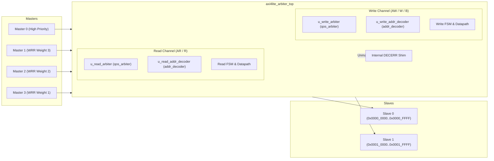

# Architecture Specification — Multi-Master AXI4-Lite Arbiter

## 1. Top-Level Architectural Overview

The VELTRAXX'26 PS02 Multi-Master AXI4-Lite Arbiter interconnects **4 AXI4-Lite Masters** (`M0`–`M3`) with **2 AXI4-Lite Slaves** (`Slave 0`, `Slave 1`) over a shared internal multiplexed datapath with decoupled, independent read and write arbitration channels.



---

## 2. Top-Level Parameters

| Parameter | Type | Default Value | Description |
|---|---|---|---|
| `NUM_MASTERS` | `int` | `4` | Number of upstream AXI4-Lite master ports |
| `NUM_SLAVES` | `int` | `2` | Number of downstream AXI4-Lite slave ports |
| `ADDR_WIDTH` | `int` | `32` | Address bus width in bits |
| `DATA_WIDTH` | `int` | `32` | Data bus width in bits |
| `STRB_WIDTH` | `int` | `DATA_WIDTH / 8` | Write strobe width (4 bits for 32-bit data) |
| `M0_WEIGHT` | `int` | `1` | Service weight for Master 0 (strictly priority mode) |
| `M1_WEIGHT` | `int` | `3` | WRR weight / quota for Master 1 |
| `M2_WEIGHT` | `int` | `2` | WRR weight / quota for Master 2 |
| `M3_WEIGHT` | `int` | `1` | WRR weight / quota for Master 3 |
| `AGE_THRESHOLD`| `int` | `64` | Starvation aging cycle threshold for M0 suppression |
| `SLAVE0_BASE` | `logic [31:0]` | `32'h0000_0000` | Slave 0 Base Address |
| `SLAVE0_SIZE` | `logic [31:0]` | `32'h0001_0000` | Slave 0 Address Space Size (64 KB) |
| `SLAVE1_BASE` | `logic [31:0]` | `32'h0001_0000` | Slave 1 Base Address |
| `SLAVE1_SIZE` | `logic [31:0]` | `32'h0001_0000` | Slave 1 Address Space Size (64 KB) |

---

## 3. Module Hierarchy & Organization

```
src/rtl/
├── addr_decoder.sv          ← Zero-latency combinational address decoder
├── qos_arbiter.sv           ← Parameterized QoS Arbiter (WRR + Aging + Priority)
└── axi4lite_arbiter_top.sv  ← Top-level AXI4-Lite 4M-2S Interconnect
```

---

## 4. Arbitration Algorithm & Policies

### 4.1 Master 0 Priority & Preemption Boundary
- **Preemption Rule**: Master 0 is evaluated whenever it requests service and no pending lower-priority master has reached the starvation aging threshold.
- **In-Flight Lock**: Preemption occurs **only** at transaction decision boundaries (when the respective channel FSM is in `IDLE`). In-flight write transactions (AW $\to$ W $\to$ B) and in-flight read transactions (AR $\to$ R) are never interrupted or corrupted.

### 4.2 Weighted Round-Robin (M1–M3)
- Masters M1, M2, and M3 are arbitrated using dynamic quota counters initialized to `M1_WEIGHT` (3), `M2_WEIGHT` (2), and `M3_WEIGHT` (1).
- Quotas decrement upon completion of each transaction (`transaction_complete` pulse).
- When a master exhausts its quota or ceases requesting, the arbiter advances round-robin to the next requesting master.
- When all active quotas reach zero, quotas are reloaded.

### 4.3 Anti-Starvation Aging
- If Master 0 is actively granted while lower-priority requests (`M1`..`M3`) remain pending, an internal `aging_timer` increments every clock cycle.
- When `aging_timer >= AGE_THRESHOLD` (64 cycles), `starvation_flag` asserts, suppressing M0 priority and forcing round-robin service among waiting masters.
- The aging timer resets to zero upon completion of any lower-priority transaction.

---

## 5. Address Decoding & DECERR Handling

The `addr_decoder` module uses unsigned range comparisons:
- **Slave 0**: `32'h0000_0000` to `32'h0000_FFFF` $\implies$ `slave_sel[0] = 1`
- **Slave 1**: `32'h0001_0000` to `32'h0001_FFFF` $\implies$ `slave_sel[1] = 1`
- **Unmapped Address**: All other addresses $\implies$ `invalid_addr = 1`

### Internal DECERR Shim Behavior
- When an unmapped address is targeted:
  - Downstream slave `AWVALID`, `WVALID`, and `ARVALID` remain strictly deasserted.
  - The interconnect acknowledges upstream `AWVALID`/`WVALID` or `ARVALID` internally.
  - Returns `BRESP = 2'b11` (DECERR) on the write channel, or `RRESP = 2'b11` (DECERR) with `RDATA = 32'h0` on the read channel.

---

## 6. Channel Datapaths and Finite State Machines

### 6.1 Write Channel FSM (`w_state`)

$$\text{W\_IDLE} \xrightarrow{\text{grant \& awvalid}} \text{W\_AW\_WAIT} \xrightarrow{\text{awready}} \text{W\_W\_WAIT} \xrightarrow{\text{wvalid \& wready}} \text{W\_B\_WAIT} \xrightarrow{\text{bvalid \& bready}} \text{W\_IDLE}$$

- `W_IDLE`: Samples `u_write_arbiter` grant, latches `w_owner_m_id`, address, protection, and target slave.
- `W_AW_WAIT`: Asserts `m_axi_awvalid` to target slave until `m_axi_awready` handshakes.
- `W_W_WAIT`: Routes write data and strobes from owning master to target slave until handshake completes.
- `W_B_WAIT`: Routes write response strictly to owning master. Upon `BREADY` handshake, asserts `write_arb_tx_done` for 1 cycle and returns to `W_IDLE`.

### 6.2 Read Channel FSM (`r_state`)

$$\text{R\_IDLE} \xrightarrow{\text{grant \& arvalid}} \text{R\_AR\_WAIT} \xrightarrow{\text{arready}} \text{R\_R\_WAIT} \xrightarrow{\text{rvalid \& rready}} \text{R\_IDLE}$$

- `R_IDLE`: Samples `u_read_arbiter` grant, latches `r_owner_m_id`, address, protection, and target slave.
- `R_AR_WAIT`: Asserts `m_axi_arvalid` to target slave until `m_axi_arready` handshakes.
- `R_R_WAIT`: Routes read data and response strictly to owning master. Upon `RREADY` handshake, asserts `read_arb_tx_done` for 1 cycle and returns to `R_IDLE`.

---

## 7. Clock & Reset Strategy

- Single global clock: `aclk` (nominally 100 MHz).
- Synchronous active-low reset: `aresetn`.
- On reset assertion (`!aresetn`):
  - FSMs return to `W_IDLE` / `R_IDLE`.
  - All output valid and ready signals are driven to zero.
  - Quotas and aging timers re-initialize cleanly without inferred latches.
