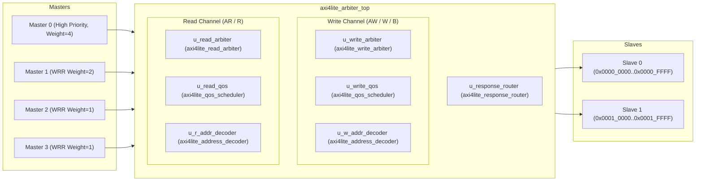

# Architecture Specification — Multi-Master AXI4-Lite Arbiter

## 1. Top-Level Architectural Overview

The VELTRAXX'26 PS02 Multi-Master AXI4-Lite Arbiter interconnects **4 AXI4-Lite Masters** (`M0`–`M3`) with **2 AXI4-Lite Slaves** (`Slave 0`, `Slave 1`) over a shared internal multiplexed datapath with decoupled, independent read and write arbitration channels.



---

## 2. Complete Top-Level Port List

### Clock & Reset

| Port | Direction | Width | Description |
|---|---|---|---|
| `aclk` | input | 1 | System clock (100 MHz nominal) |
| `aresetn` | input | 1 | Asynchronous active-low reset |

### QoS Configuration (Sideband)

| Port | Direction | Width | Description |
|---|---|---|---|
| `cfg_weight_m0` | input | `[3:0]` | WRR weight for Master 0 (default: 4) |
| `cfg_weight_m1` | input | `[3:0]` | WRR weight for Master 1 (default: 2) |
| `cfg_weight_m2` | input | `[3:0]` | WRR weight for Master 2 (default: 1) |
| `cfg_weight_m3` | input | `[3:0]` | WRR weight for Master 3 (default: 1) |
| `cfg_master0_priority` | input | 1 | Enable M0 preemptive priority (PREEMPT_EN) |
| `cfg_age_threshold` | input | `[7:0]` | Anti-starvation aging threshold (default: 64) |
| `cfg_master0_burst_limit` | input | `[7:0]` | Max consecutive M0 grants before forced suppression |

### Upstream Master AXI4-Lite Interfaces (`s_axi_*`)

| Port | Direction | Width | Description |
|---|---|---|---|
| `s_axi_awaddr` | input | `[3:0][31:0]` | Write address (per master) |
| `s_axi_awprot` | input | `[3:0][2:0]` | Write protection (per master) |
| `s_axi_awvalid` | input | `[3:0]` | Write address valid (per master) |
| `s_axi_awready` | output | `[3:0]` | Write address ready (per master) |
| `s_axi_wdata` | input | `[3:0][31:0]` | Write data (per master) |
| `s_axi_wstrb` | input | `[3:0][3:0]` | Write strobe (per master) |
| `s_axi_wvalid` | input | `[3:0]` | Write data valid (per master) |
| `s_axi_wready` | output | `[3:0]` | Write data ready (per master) |
| `s_axi_bresp` | output | `[3:0][1:0]` | Write response (per master) |
| `s_axi_bvalid` | output | `[3:0]` | Write response valid (per master) |
| `s_axi_bready` | input | `[3:0]` | Write response ready (per master) |
| `s_axi_araddr` | input | `[3:0][31:0]` | Read address (per master) |
| `s_axi_arprot` | input | `[3:0][2:0]` | Read protection (per master) |
| `s_axi_arvalid` | input | `[3:0]` | Read address valid (per master) |
| `s_axi_arready` | output | `[3:0]` | Read address ready (per master) |
| `s_axi_rdata` | output | `[3:0][31:0]` | Read data (per master) |
| `s_axi_rresp` | output | `[3:0][1:0]` | Read response (per master) |
| `s_axi_rvalid` | output | `[3:0]` | Read data valid (per master) |
| `s_axi_rready` | input | `[3:0]` | Read data ready (per master) |

### Downstream Slave AXI4-Lite Interfaces (`m_axi_*`)

| Port | Direction | Width | Description |
|---|---|---|---|
| `m_axi_awaddr` | output | `[1:0][31:0]` | Write address to slave |
| `m_axi_awprot` | output | `[1:0][2:0]` | Write protection to slave |
| `m_axi_awvalid` | output | `[1:0]` | Write address valid to slave |
| `m_axi_awready` | input | `[1:0]` | Write address ready from slave |
| `m_axi_wdata` | output | `[1:0][31:0]` | Write data to slave |
| `m_axi_wstrb` | output | `[1:0][3:0]` | Write strobe to slave |
| `m_axi_wvalid` | output | `[1:0]` | Write data valid to slave |
| `m_axi_wready` | input | `[1:0]` | Write data ready from slave |
| `m_axi_bresp` | input | `[1:0][1:0]` | Write response from slave |
| `m_axi_bvalid` | input | `[1:0]` | Write response valid from slave |
| `m_axi_bready` | output | `[1:0]` | Write response ready to slave |
| `m_axi_araddr` | output | `[1:0][31:0]` | Read address to slave |
| `m_axi_arprot` | output | `[1:0][2:0]` | Read protection to slave |
| `m_axi_arvalid` | output | `[1:0]` | Read address valid to slave |
| `m_axi_arready` | input | `[1:0]` | Read address ready from slave |
| `m_axi_rdata` | input | `[1:0][31:0]` | Read data from slave |
| `m_axi_rresp` | input | `[1:0][1:0]` | Read response from slave |
| `m_axi_rvalid` | input | `[1:0]` | Read data valid from slave |
| `m_axi_rready` | output | `[1:0]` | Read data ready to slave |

---

## 3. Compile-Time Parameters

| Parameter | Type | Default | Description |
|---|---|---|---|
| `NUM_MASTERS` | `int` | `4` | Number of upstream master ports (must be 4) |
| `NUM_SLAVES` | `int` | `2` | Number of downstream slave ports (must be 2) |
| `ADDR_WIDTH` | `int` | `32` | Address bus width |
| `DATA_WIDTH` | `int` | `32` | Data bus width |
| `S0_BASE` / `SLAVE0_BASE` | `logic [31:0]` | `32'h0000_0000` | Slave 0 base address |
| `S0_SIZE` / `SLAVE0_SIZE` | `logic [31:0]` | `32'h0001_0000` | Slave 0 size (64 KB) |
| `S1_BASE` / `SLAVE1_BASE` | `logic [31:0]` | `32'h0001_0000` | Slave 1 base address |
| `S1_SIZE` / `SLAVE1_SIZE` | `logic [31:0]` | `32'h0001_0000` | Slave 1 size (64 KB) |
| `PREEMPT_EN` | `int` | `1` | Enable M0 preemption behavior |

---

## 4. Module Hierarchy

```
src/rtl/
├── axi4lite_pkg.sv              ← Package: FSM types, response codes, design constants
├── axi4lite_address_decoder.sv  ← Combinational address decoder (slave_sel + invalid_addr)
│                                   Includes elaboration-time overlap detection
├── axi4lite_qos_scheduler.sv   ← Budget-based WRR + M0 Priority + Per-master Aging
│                                   Includes aging counters (inline, 8-bit saturating)
├── axi4lite_response_router.sv ← Response mux/demux with inline DECERR generation
│                                   Acts as default_slave for unmapped addresses
├── axi4lite_write_arbiter.sv   ← Per-master AW/W skid buffers + Write FSM + mux
│                                   Contains write_mux (AW/W to slave) inline
├── axi4lite_read_arbiter.sv    ← Read arbitration FSM + AR mux
│                                   Contains read_mux (AR to slave) inline
└── axi4lite_arbiter_top.sv     ← Top-level instantiation and wiring
```

### Module Mapping to Spec Names

| Spec Module Name | Implementation | Notes |
|---|---|---|
| `axi4lite_arbiter_top` | `axi4lite_arbiter_top.sv` | Direct match |
| `addr_decoder` | `axi4lite_address_decoder.sv` | Prefixed naming convention |
| `wrr_scheduler` | `axi4lite_qos_scheduler.sv` | WRR + aging + priority |
| `age_counter` | Inline in `axi4lite_qos_scheduler.sv` | 8-bit saturating per-master |
| `write_arbiter` | `axi4lite_write_arbiter.sv` | Prefixed naming convention |
| `read_arbiter` | `axi4lite_read_arbiter.sv` | Prefixed naming convention |
| `write_mux` | Inline in `axi4lite_write_arbiter.sv` | Slave-side AW/W output mux |
| `read_mux` | Inline in `axi4lite_read_arbiter.sv` | Slave-side AR output mux |
| `resp_demux` | `axi4lite_response_router.sv` | B/R response routing |
| `default_slave` | Inline in `axi4lite_response_router.sv` | DECERR generation |

---

## 5. Transaction Ownership Model

### Write Transaction Lifecycle
```
Master → AW buffer → W buffer → [both valid?] → QoS grant → Latch owner/target
→ W_ADDR (AW to slave) → W_DATA (W to slave) → W_RESP (B from slave/DECERR)
→ B routed to owner master → buffers freed → arbiter released
```

**Key invariants:**
- Owner ID is latched at W_IDLE→W_ADDR transition and never changes until W_IDLE
- Both AW and W buffers must be valid before arbitration eligibility
- AW and W from the same master are always paired (no cross-master mixing)
- DECERR transactions never reach real slaves

### Read Transaction Lifecycle
```
Master → ARVALID → QoS grant → Latch owner/target → ARREADY to master
→ R_ADDR (AR to slave) → R_RESP (R from slave/DECERR)
→ R routed to owner master → arbiter released
```

**Key invariants:**
- Owner ID is latched at R_IDLE→R_ADDR transition
- Only the owner master receives ARREADY
- DECERR generates ARREADY immediately (no slave interaction)

---

## 6. Arbitration Algorithm & Policies

### 6.1 Priority Hierarchy (highest first)
1. **Anti-starvation promotion** — Any master with age ≥ `cfg_age_threshold`
2. **Master 0 preemptive priority** — When `cfg_master0_priority` and not burst-exhausted
3. **Weighted Round-Robin** — Budget-based WRR among M1–M3
4. **Master 0 fallback** — M0 without priority or after burst exhaustion

### 6.2 Master 0 Priority & Burst Limiting
- M0 is evaluated when `cfg_master0_priority` is asserted and no master has exceeded the age threshold
- **Preemption occurs ONLY at transaction boundaries** (FSM in IDLE). In-flight transactions are **never** interrupted
- `cfg_master0_burst_limit` caps consecutive M0 grants. After the limit, M0 is demoted for one WRR round
- This is safe: M0 preemption only affects arbitration decisions, never ongoing AXI handshakes

### 6.3 Weighted Round-Robin (M1–M3)
- Budget counters initialized to `cfg_weight_m*` (clamped: 0→1)
- Default weights: M0=4, M1=2, M2=1, M3=1 (WRR_WEIGHTS = {4,2,1,1})
- On transaction completion, the active master's budget decrements
- When budget exhausts, the round-robin pointer advances
- When all active budgets hit zero, all budgets reload

### 6.4 Per-Master Anti-Starvation Aging
- Independent 8-bit saturating age counters for M1, M2, M3
- Age increments each cycle a master has a pending request but is not being served
- Resets to zero when the master gets a grant
- Default threshold: `AGE_THRESHOLD = 64`
- When `age >= cfg_age_threshold`, the master is promoted above M0 priority and above WRR order
- Tie-breaking among aged masters uses the round-robin pointer

---

## 7. Write Path — AW/W Buffering Strategy

### 7.1 Per-Master Skid Buffers
Each master has independent AW and W buffers:
- Buffers accept the next request even while the current transaction is in-flight (pipelined READY)
- `buf_locked` prevents overwrite during active transactions
- Arbitration eligibility requires **both** AW and W buffers valid for the same master

### 7.2 Write FSM (`w_state`)
```
W_IDLE → W_ADDR → W_DATA → W_RESP → W_IDLE
```
- `W_IDLE`: Samples QoS grant, latches owner, address, slave target
- `W_ADDR`: Asserts `m_axi_awvalid` to target slave until `m_axi_awready` (skipped for DECERR)
- `W_DATA`: Asserts `m_axi_wvalid` to target slave until `m_axi_wready` (skipped for DECERR)
- `W_RESP`: Routes `BRESP`/`BVALID` to owning master until `BREADY` (DECERR generates `BRESP=2'b11` internally)

---

## 8. Read Path

### 8.1 Read FSM (`r_state`)
```
R_IDLE → R_ADDR → R_RESP → R_IDLE
```
- `R_IDLE`: Samples QoS grant, latches owner, address, slave target
- `R_ADDR`: Asserts `m_axi_arvalid` to target slave until `m_axi_arready` (DECERR gives ARREADY immediately)
- `R_RESP`: Routes `RDATA`/`RRESP`/`RVALID` to owning master until `RREADY` (DECERR generates `RRESP=2'b11`, `RDATA=0`)

---

## 9. Address Decoding & DECERR Handling

The `axi4lite_address_decoder` uses unsigned range comparisons with 64-bit arithmetic to prevent 32-bit wrap-around:
- **Slave 0**: `[S0_BASE, S0_BASE + S0_SIZE - 1]` → `slave_sel[0] = 1`
- **Slave 1**: `[S1_BASE, S1_BASE + S1_SIZE - 1]` → `slave_sel[1] = 1`
- **Unmapped**: `invalid_addr = 1`
- **Overlap**: Slave 0 has decode priority. Elaboration-time warning if overlap detected.

### Address Map

| Region | Base | End | Size |
|---|---|---|---|
| Slave 0 | `0x0000_0000` | `0x0000_FFFF` | 64 KB |
| Slave 1 | `0x0001_0000` | `0x0001_FFFF` | 64 KB |
| Unmapped | All other | — | DECERR |

### DECERR Shim Behavior
- Downstream slave VALID signals are deasserted for unmapped accesses
- The response router generates `BRESP = 2'b11` / `RRESP = 2'b11` with `RDATA = 32'h0` internally
- Invalid transactions **never** reach real slaves

---

## 10. Clock & Reset Strategy

- **Single global clock**: `aclk` (nominally 100 MHz)
- **Asynchronous active-low reset**: `aresetn`
  - RTL uses: `always_ff @(posedge aclk or negedge aresetn)`
  - SDC uses: `set_false_path -from [get_ports aresetn]` for timing analysis
  - Recovery/removal timing checked by STA tools
- **On reset**:
  - FSMs return to IDLE states
  - All output VALID and READY signals driven to zero
  - Buffers, counters, and ownership registers clear cleanly
  - QoS budgets, age counters, burst counters all reset
  - Write arbiter: `aw_buf_valid=0`, `w_buf_valid=0`, `w_state=W_IDLE`
  - Read arbiter: `r_state=R_IDLE`, `target_slave_r=0`, `target_invalid_r=0`
  - QoS scheduler: `is_active=0`, `rr_ptr=1`, budgets=1, ages=0

---

## 11. Known Limitations

1. **Single Outstanding Transaction Per Channel**: 1 outstanding write + 1 outstanding read at any time. This is a conservative policy chosen for correctness; pipelining requires tracking multiple owners.
2. **Fixed Address Map**: Compile-time parameters, no software-remappable registers.
3. **Frozen 4M/2S**: Hardcoded to 4 masters and 2 slaves. Changing triggers `$fatal`.
4. **M0 Weight in WRR**: When `cfg_master0_priority` is asserted, M0's WRR weight is not used (M0 bypasses WRR). M0's weight only matters when `cfg_master0_priority = 0`.
5. **No GDS**: This is verified RTL + technology-independent synthesis. Physical design requires a PDK, LEF/DEF, Liberty files, and signoff tools.
6. **No Exclusive Access**: AXI4-Lite does not support exclusive transactions (`EXOKAY` response is not generated).
