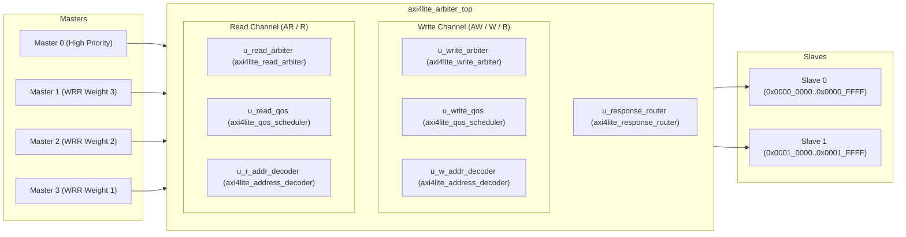

# Architecture Specification — Multi-Master AXI4-Lite Arbiter

## 1. Top-Level Architectural Overview

The VELTRAXX'26 PS02 Multi-Master AXI4-Lite Arbiter interconnects **4 AXI4-Lite Masters** (`M0`–`M3`) with **2 AXI4-Lite Slaves** (`Slave 0`, `Slave 1`) over a shared internal multiplexed datapath with decoupled, independent read and write arbitration channels.



---

## 2. Runtime Configuration Interface

| Port | Width | Description |
|---|---|---|
| `cfg_weight_m0` | `[3:0]` | Service weight for Master 0 (used when M0 participates in WRR) |
| `cfg_weight_m1` | `[3:0]` | WRR budget for Master 1 (default: 3) |
| `cfg_weight_m2` | `[3:0]` | WRR budget for Master 2 (default: 2) |
| `cfg_weight_m3` | `[3:0]` | WRR budget for Master 3 (default: 1) |
| `cfg_master0_priority` | `1` | Enable M0 high-priority preemption |
| `cfg_age_threshold` | `[7:0]` | Per-master aging cycle threshold for anti-starvation |
| `cfg_master0_burst_limit` | `[7:0]` | Max consecutive M0 grants before forced suppression |

## 3. Compile-Time Parameters

| Parameter | Type | Default | Description |
|---|---|---|---|
| `NUM_MASTERS` | `int` | `4` | Number of upstream master ports (must be 4) |
| `NUM_SLAVES` | `int` | `2` | Number of downstream slave ports (must be 2) |
| `ADDR_WIDTH` | `int` | `32` | Address bus width |
| `DATA_WIDTH` | `int` | `32` | Data bus width |
| `S0_BASE` | `logic [31:0]` | `32'h0000_0000` | Slave 0 base address |
| `S0_SIZE` | `logic [31:0]` | `32'h0001_0000` | Slave 0 size (64 KB) |
| `S1_BASE` | `logic [31:0]` | `32'h0001_0000` | Slave 1 base address |
| `S1_SIZE` | `logic [31:0]` | `32'h0001_0000` | Slave 1 size (64 KB) |

---

## 4. Module Hierarchy

```
src/rtl/
├── axi4lite_pkg.sv              ← FSM state type definitions
├── axi4lite_address_decoder.sv  ← Combinational address decoder (slave_sel + invalid_addr)
├── axi4lite_qos_scheduler.sv   ← Budget-based WRR + M0 Priority + Per-master Aging
├── axi4lite_response_router.sv ← Response mux/demux with inline DECERR generation
├── axi4lite_write_arbiter.sv   ← Per-master AW/W skid buffers + Write FSM
├── axi4lite_read_arbiter.sv    ← Read arbitration FSM
└── axi4lite_arbiter_top.sv     ← Top-level instantiation and wiring
```

---

## 5. Arbitration Algorithm & Policies

### 5.1 Master 0 Priority & Burst Limiting
- M0 is evaluated when `cfg_master0_priority` is asserted and no master has exceeded the age threshold.
- Preemption occurs **only** at transaction boundaries (FSM in IDLE). In-flight transactions are never interrupted.
- `cfg_master0_burst_limit` caps consecutive M0 grants. After the limit, M0 is demoted for one WRR round.

### 5.2 Weighted Round-Robin (M0–M3)
- Budget counters initialized to `cfg_weight_m*` (clamped: 0→1).
- On transaction completion, the active master's budget decrements.
- When budget exhausts, the round-robin pointer advances.
- When all active budgets hit zero, all budgets reload.

### 5.3 Per-Master Anti-Starvation Aging
- Independent 8-bit saturating age counters for M1, M2, M3.
- Age increments each cycle a master has a pending request but is not being served.
- Resets to zero when the master gets a grant.
- When `age >= cfg_age_threshold`, the master is promoted above M0 priority and above WRR order.
- Tie-breaking among aged masters uses the round-robin pointer.

---

## 6. Write Path — AW/W Buffering Strategy

### 6.1 Per-Master Skid Buffers
Each master has independent AW and W buffers:
- Buffers accept the next request even while the current transaction is in-flight (pipelined READY).
- `buf_locked` prevents overwrite during active transactions.
- Arbitration eligibility requires **both** AW and W buffers valid for the same master.

### 6.2 Write FSM (`w_state`)
```
W_IDLE → W_ADDR → W_DATA → W_RESP → W_IDLE
```
- `W_IDLE`: Samples QoS grant, latches owner, address, slave target.
- `W_ADDR`: Asserts `m_axi_awvalid` to target slave until `m_axi_awready`.
- `W_DATA`: Asserts `m_axi_wvalid` to target slave until `m_axi_wready`.
- `W_RESP`: Routes `BRESP`/`BVALID` to owning master until `BREADY`.

---

## 7. Read Path

### 7.1 Read FSM (`r_state`)
```
R_IDLE → R_ADDR → R_RESP → R_IDLE
```
- `R_IDLE`: Samples QoS grant, latches owner, address, slave target.
- `R_ADDR`: Asserts `m_axi_arvalid` to target slave until `m_axi_arready`.
- `R_RESP`: Routes `RDATA`/`RRESP`/`RVALID` to owning master until `RREADY`.

---

## 8. Address Decoding & DECERR Handling

The `axi4lite_address_decoder` uses unsigned range comparisons:
- **Slave 0**: `[S0_BASE, S0_BASE + S0_SIZE - 1]` → `slave_sel[0] = 1`
- **Slave 1**: `[S1_BASE, S1_BASE + S1_SIZE - 1]` → `slave_sel[1] = 1`
- **Unmapped**: `invalid_addr = 1`

### DECERR Shim Behavior
- Downstream slave VALID signals are deasserted for unmapped accesses.
- The response router generates `BRESP = 2'b11` / `RRESP = 2'b11` with `RDATA = 32'h0` internally.

---

## 9. Clock & Reset Strategy

- Single global clock: `aclk` (nominally 100 MHz).
- Synchronous active-low reset: `aresetn`.
- On reset:
  - FSMs return to IDLE states.
  - All output VALID and READY signals driven to zero.
  - Buffers, counters, and ownership registers clear cleanly.
